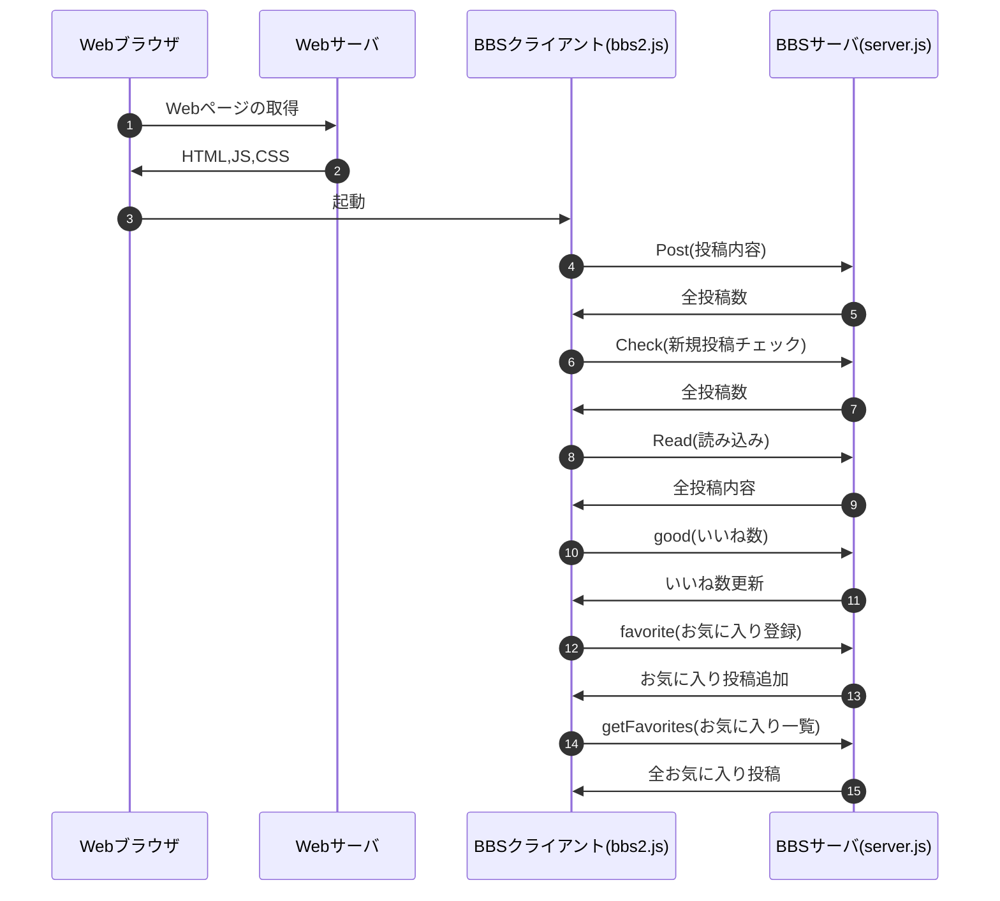

```mermaid
sequenceDiagram
  autonumber
  Webブラウザ ->> Webサーバ: Webページの取得
  Webサーバ ->> Webブラウザ:HTML,JS,CSS
  Webブラウザ ->> BBSクライアント(bbs2.js):起動
  BBSクライアント(bbs2.js) ->> BBSサーバ(server.js):Post(投稿内容)
  BBSサーバ(server.js) ->> BBSクライアント(bbs2.js):全投稿数
  BBSクライアント(bbs2.js) ->> BBSサーバ(server.js):Check(新規投稿チェック)
  BBSサーバ(server.js) ->> BBSクライアント(bbs2.js):全投稿数
  BBSクライアント(bbs2.js) ->> BBSサーバ(server.js):Read(読み込み)
  BBSサーバ(server.js) ->> BBSクライアント(bbs2.js):全投稿内容
  BBSクライアント(bbs2.js) ->> BBSサーバ(server.js):good(いいね数)
  BBSサーバ(server.js) ->> BBSクライアント(bbs2.js):いいね数更新
  BBSクライアント(bbs2.js) ->> BBSサーバ(server.js):favorite(お気に入り登録)
  BBSサーバ(server.js) ->> BBSクライアント(bbs2.js):お気に入り投稿追加
  BBSクライアント(bbs2.js) ->> BBSサーバ(server.js):getFavorites(お気に入り一覧)
  BBSサーバ(server.js) ->> BBSクライアント(bbs2.js):全お気に入り投稿
```
